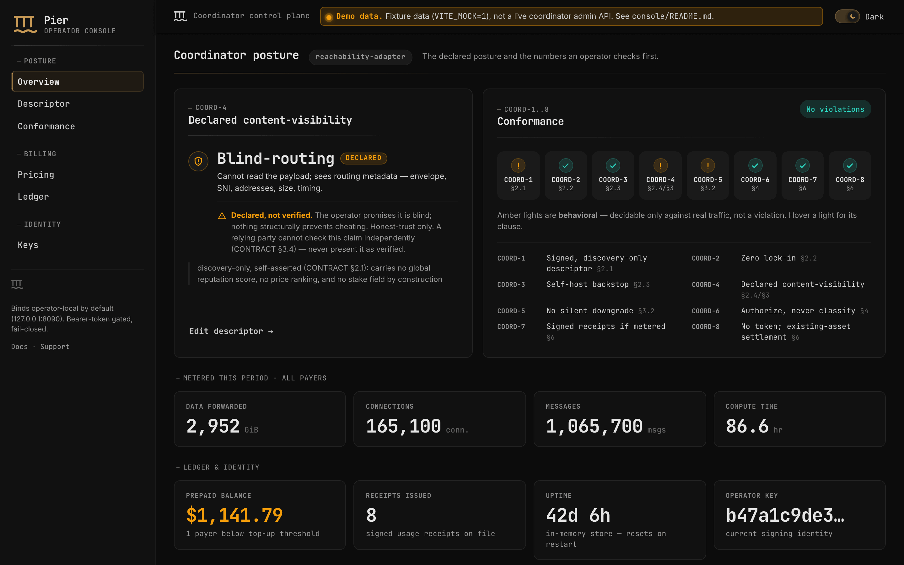

# Operator Console

The web UI an operator uses to run a coordinator: it fronts the admin crate's HTTP API
(`crates/pier-admin`) — the coordinator-kind-agnostic control plane for a descriptor, a
tariff, metering/receipts, quota, and the operator's signing keys.

The UI is **rebrandable**, not merely unbranded: see [Branding](#branding) below. Pier — the
broker (coordinator) reference implementation of the KOTVA standard — is the default brand;
Vulos Cloud is the first alternate, with no privileges the next one won't have.

Six views, one left-nav shell:

| # | Route | What it's for |
|---|-------|----------------|
| 01 | Overview | Kind + declared content-visibility badge, live COORD-1..8 strip, headline metrics (metered usage, prepaid balance, receipts issued, uptime). |
| 02 | Descriptor | View/edit operator policy + declared visibility, sign & publish. Warns before a silent visibility downgrade (CONTRACT §3.2) and requires explicit disclosure to proceed. |
| 03 | Pricing | Recommended cost-plus USD pricing (Hetzner/Vultr basis) as a reference only, plus your own editable, signable `TariffSchedule`. No token field exists anywhere in this UI (DIRECTION §5). |
| 04 | Billing | Prepaid credit balance per payer, a Top-up action (patala rails — stablecoin or card), metered usage, and signed receipts — every receipts panel surfaces the one-directional-audit caveat (CONTRACT §6, R-6). An optional "monthly card" (postpaid via patala-hyperswitch) toggle sits clearly secondary to prepaid. |
| 05 | Keys | Current signing pubkey + rotate (re-signs the descriptor; old keys kept in history, never dropped). |
| 06 | Conformance | The full COORD-1..8 checklist — pass / behavioral / violation, with clause refs and what each behavioral item still needs a runtime test for. |



## Stack

Vite + Svelte 5 (runes) + TypeScript. No UI framework, no CSS framework, no router library —
a ~40-line hash router and hand-rolled components, on purpose: the surface is six views, not
sixty. Fonts are self-hosted via `@fontsource*` (JetBrains Mono for body and chrome, Inter for
running prose) so the console never depends on a font CDN and stays air-gappable.

**Design language:** cool near-black chrome and a single accent rather than a generic
dashboard template — an accent primary CTA, an ink stamp on freshly signed artifacts, and
COORD-1..8 rendered as running lights (green pass / amber behavioral / red violation) via the
shared `--status-*` tokens. Dark is the shipped default; a full light palette is defined too,
and the theme toggle in the top bar overrides `prefers-color-scheme`, which is the default.

The token ladder, geometry, shadows and the monospace IDE/terminal aesthetic were adopted
from the Vulos OS theme (`vulos-static/src/theme.css`, which mirrors the OS `index.css`).
That is provenance, not branding: `src/app.css` itself is brand-neutral and every brand
shares it byte for byte — the two builds below emit the *same* CSS chunk hash.

## Branding

Anyone may run this coordinator, so the console must never make a third-party deployment look
Vulos-operated. Every branding site — name, wordmark, mark, accent, favicon, `<title>`, meta
description, docs/support links, and the `localStorage` namespace — reads from one object.

```
src/brands/
  types.ts        the Brand interface (and why it is split in two)
  pier.meta.ts    Pier — the DEFAULT brand
  pier.ts         pier.meta + the mark, inlined from ../brand/pier.svg
  vulos.meta.ts   Vulos Cloud — the first alternate
  vulos.ts
  assets/         marks that do not have a home elsewhere in the repo
```

```ts
interface Brand {
  name: string;                 // document title, accessible mark label
  wordmark: string;             // sidebar masthead text
  tagline: string;              // second masthead line, second half of <title>
  description: string;          // <meta name="description">
  markSvg: string;              // inline SVG, currentColor-filled
  accent: string;               // one hex; the whole accent ladder derives from it
  accentContrast: string;       // ink ON a solid accent surface
  accentFill: string;           // fill role — the true brand colour
  accentFillContrast: string;   // ink on an accentFill surface
  storagePrefix: string;        // namespace for every localStorage key
  faviconHref: string;          // href stamped into <link rel="icon">
  docsUrl: string;              // this deployment's operator docs
  supportContact: string;       // email address or URL
  markPath: string;             // where markSvg is read from, relative to console/
}
```

Build a brand with `VITE_BRAND`:

```sh
pnpm build                      # Pier (the default — VITE_BRAND unset)
VITE_BRAND=vulos pnpm build     # Vulos Cloud
```

`vite.config.ts` resolves a `$brand` alias to `src/brands/<VITE_BRAND>.ts`, serves each
brand's mark as `virtual:brand-mark/<brand>`, emits `/favicon.svg` from that same mark file,
and stamps the title/description/favicon/accent tokens into `index.html`. An unknown
`VITE_BRAND` is a hard error, never a silent fallback to the default.

**Two rules keep this honest.**

1. *No per-brand conditionals in components.* Nothing outside `src/brands/` names a brand.
   A component reads `brand.wordmark`; it never asks which brand it is rendering.
2. *Only four values differ.* Layout, geometry, spacing, typography and every `--bg-*`,
   `--border-*`, `--text-*` token are shared. Accent hover, the soft tint, the focus ring and
   the selection surface pair are all derived from `--brand-accent` with `color-mix`, so a new
   brand supplies one hex and the ladder retints itself.

### Adding a brand

Add `<name>.meta.ts` and `<name>.ts`, register the meta in `BRANDS` in `vite.config.ts`, point
`markPath` at an SVG, and build with `VITE_BRAND=<name>`. No component changes.

### The gate

```sh
pnpm check:brand          # build the DEFAULT target, assert it ships nothing foreign
pnpm check:brand:mutate   # prove that gate can fail
```

`scripts/check-brand-isolation.sh` builds with `VITE_BRAND` **unset**, then scans every file in
`dist/` — including the vendored fonts, read as bytes — for `vulos` and `ephor`,
case-insensitively, and asserts the emitted favicon differs from the one the Vulos brand emits.
It runs on **built output**, never source: an SVG inlined through a virtual module, a string
folded into a minified chunk and a value stamped into `index.html` by a plugin are all
invisible to a source grep and all shipped to users. It also asserts *coverage* — the file
count and a named set of artifacts — so a broken glob cannot read as a clean scan.

`scripts/mutation-test-brand-isolation.sh` is the evidence that the gate works: it breaks the
guarded property six different ways (a brand name in a shared component, in the shared
stylesheet, in the default brand's own data; the pre-rename name; a favicon identical to the
Vulos one; a scan that reads zero files), asserts the gate goes red each time, restores the
tree, and asserts it goes green again.

### Storage keys are brand-namespaced — this was a bug

Every `localStorage` key derives from `brand.storagePrefix` (`pier:theme`,
`vulos-cloud:admin-token`, …). Before this, both keys were hardcoded to one namespace: two
brands of this console served from the same origin silently overwrote each other's theme
choice **and each other's admin bearer token**.

## Develop

```sh
pnpm install
pnpm dev          # http://localhost:5173, mock data (VITE_MOCK=1, the default — see .env)
```

## Build

```sh
pnpm build        # -> dist/
pnpm preview       # serve dist/ locally
```

`pnpm check` runs `svelte-check` + `tsc` with no emit.

## Connecting to a real coordinator

By default (`.env`, committed — no secrets in it) this build runs entirely on the fixtures in
`src/lib/api.ts` (`VITE_MOCK=1`), so it works standalone for development and for the
screenshots below. To point it at a live coordinator instead:

1. Set `VITE_MOCK=0` and `VITE_API_BASE=http://127.0.0.1:8090` (or wherever the admin API
   binds — it defaults to loopback-only, see `crates/pier-admin/src/config.rs`) at build time,
   or in a `.env.local`.
2. The admin API is bearer-token gated and fail-closed (see the token env var in
   `crates/pier-admin/src/config.rs` — no token configured means every request is `401`, not
   merely unauthenticated). This console reads the token from
   `localStorage['<storagePrefix>:admin-token']` at runtime — `pier:admin-token` in a default
   build — or from `VITE_ADMIN_TOKEN` at build time as a fallback; it is never hardcoded or
   checked in.
3. The real admin API has no prepaid/patala surface of its own — CONTRACT §6 deliberately
   leaves settlement to an operator-supplied rail. `RealAdminClient` (`src/lib/api.ts`) calls
   a `/patala/accounts`, `/patala/topups/{payer}`, `/patala/monthly-card` convention on the
   same origin; stand up that small proxy in front of your patala integration, or swap in your
   own `AdminClient` implementation — it's one interface.

Every DTO in `src/lib/types.ts` and every call in `src/lib/api.ts`'s `RealAdminClient` is typed
1:1 against `crates/pier-admin/src/{descriptor,tariff,billing,quota,keys,conformance}.rs` — if the
Rust DTOs change, this is the file to update.

## Mock mode

`src/lib/api.ts` exports `MockAdminClient`, a full in-memory implementation of the same
`AdminClient` interface `RealAdminClient` implements — the rest of the app never knows which
one it's talking to. It ships one realistic fixture posture: a `reachability-adapter`
declaring `blind-routing / declared` — the same "bare adapter-zone vanity" example
`broker-economics`' own tests use — specifically so the UI's "declared, not verified" duty
(CONTRACT §3.4) has something real to demonstrate, not just the trivial `terminating` case.
Signing, rotating, publishing a tariff, topping up, and running a billing period all mutate
that in-memory state for real (Descriptor's downgrade-disclosure gate included) — there's no
backend, but there's no lie about interactivity either.

## Screenshots

```sh
pnpm build
pnpm screenshot    # -> ../docs/img/console-{dark,light}.png, console-billing-{dark,light}.png
```

`scripts/screenshot.mjs` serves the built `dist/` on a scratch port, loads the console in mock
mode (the build's default), and captures the Overview and Billing views at a 1440×900 viewport
(2x device scale), full-page, once per color scheme via Playwright's `colorScheme` emulation —
so both images are exercising the real `prefers-color-scheme` CSS path, not a hardcoded theme.

`scripts/smoke.mjs` and `scripts/interact-smoke.mjs` are ad hoc dev checks (all six routes load
with no console errors; rotate/sign/publish/top-up/run-billing all complete) — not part of the
build or the screenshot flow.
