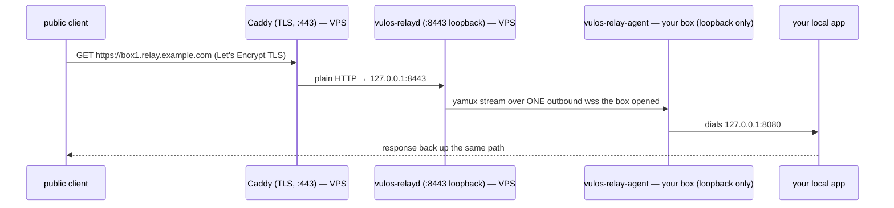

# Cloud setup — run a Pier relay on a VPS with a static IP

This is the **golden path**: take a fresh Ubuntu VPS with a static IP and a domain, and turn it into a working Pier relay that a box anywhere can dial out to and be reachable through. Every command is copy-pasteable; substitute your own domain and IP where shown.

You do **not** need an account with anyone. The relay is self-hostable and content-blind on the tunnel path: the box dials **out** to it, the relay never dials in. A hosted Pier relay is a convenience some operator may run — it is never required, and this guide never assumes one.

**What you'll have at the end:**



- **The VPS** (static IP) runs `vulos-relayd` bound to loopback, with **Caddy** in front terminating TLS via **Let's Encrypt**.
- **Your box** (behind NAT/CGNAT, no public IP) runs `vulos-relay-agent`, which dials one outbound `wss://` connection to the VPS. No inbound ports on the box.

> **Two URL styles — pick one now.** *Path mode* serves every box under one hostname (`https://relay.example.com/t/box1/`); it needs one DNS record and one ordinary certificate, so it is the easiest and where this guide's copy-paste path lands. *Subdomain mode* gives prettier URLs (`https://box1.relay.example.com`) but needs wildcard DNS **and** a wildcard certificate (DNS-01 challenge). Start with path mode; [switch to subdomain mode](#appendix-a--subdomain-mode-prettier-urls) once it works.

---

## Before you start

- A VPS you control with a **static public IPv4** (any provider — Hetzner, DigitalOcean, Vultr, Linode, a Fly machine, …). Examples below use Ubuntu 22.04/24.04 LTS.
- A **domain** (or subdomain) whose DNS you can edit, e.g. `relay.example.com`.
- SSH access to the VPS as a sudo-capable user.
- Roughly 10 minutes.

Throughout, replace:

| Placeholder | With your… |
|-------------|-----------|
| `relay.example.com` | relay hostname |
| `203.0.113.10` | VPS static IPv4 |
| `box1` | a short DNS-label-safe name for the box (`a-z0-9-`, ≤63 chars) |

---

## Step 1 — Provision and update the VPS

SSH in and bring the box up to date:

```bash
ssh youruser@203.0.113.10
sudo apt-get update && sudo apt-get -y upgrade
```

Nothing Pier-specific yet — just a current base system.

## Step 2 — Point DNS at the VPS

Create a single **A record** for the relay hostname → your static IP:

```
relay.example.com.   A   203.0.113.10
```

(Add a `AAAA` record too if your VPS has a static IPv6.) Wait for it to resolve before requesting a certificate, so Let's Encrypt's HTTP-01 challenge can reach you:

```bash
dig +short relay.example.com          # must print 203.0.113.10
```

> Subdomain mode also needs a wildcard record (`*.relay.example.com`). Ignore that for now — see [Appendix A](#appendix-a--subdomain-mode-prettier-urls).

## Step 3 — Install `vulos-relayd`

There are no prebuilt standalone binaries published; install one of two honest ways.

### Option A — build from source (native binary, pairs with systemd below)

Needs Go 1.25+. On the VPS:

```bash
# install Go 1.25 (skip if you already have it)
curl -fsSL https://go.dev/dl/go1.25.0.linux-amd64.tar.gz | sudo tar -C /usr/local -xz
export PATH=$PATH:/usr/local/go/bin

# fetch and build both binaries
git clone https://github.com/vul-os/pier.git
cd pier
go build -o /tmp/vulos-relayd ./cmd/vulos-relayd
sudo install -m755 /tmp/vulos-relayd /usr/local/bin/vulos-relayd
vulos-relayd -h    # sanity-check the flags
```

(You only need `vulos-relayd` on the VPS. The `vulos-relay-agent` binary is built the same way and installed **on the box** in Step 8.)

### Option B — Docker

The published image `ghcr.io/vul-os/vulos-relayd:latest` bundles both binaries; its entrypoint is the server. If you prefer Docker, skip Steps 5–7 and use the [Docker Compose quick path](#appendix-b--docker-compose-instead-of-systemdcaddy) instead — it wires up the same thing in one command.

## Step 4 — Create an agent grant (the token model)

The relay refuses to run "open": it authorizes agents against **grants** — a JSON array of `{token, names}`. A token is a bearer credential and may serve **only** the names it is granted. Generate one strong token now; you'll paste it into the env file in Step 5 and into the box's agent config in Step 8:

```bash
openssl rand -hex 32      # copy the output — this is box1's token
```

Optional grant fields (see [`tunnel/server/auth.go`](../tunnel/server/auth.go)): `expires_at` (RFC-3339; the grant self-revokes after it — good hygiene for leaked tokens), `previous_token` (accept an old token alongside the new one during a rotation window), and `account_id` (links the token to a control plane for metering — omit for pure self-host).

> **File vs env.** The systemd unit below carries grants inline via `VULOS_RELAY_TOKENS` in the env file — systemd reads it as root and hands the value to the process, so a `0600 root` env file works even though the unit runs under `DynamicUser`. If you'd rather keep grants in a separate `-tokens-file`, remember the *process* (the dynamic user) opens that file, so mode `0600 root` would be unreadable — hand it in via systemd's `LoadCredential=` instead, or use a static service user. The inline-env route sidesteps this; don't do both.

## Step 5 — Run `vulos-relayd` under systemd (survives reboots)

Copy the unit and env template from the repo's `deploy/` directory:

```bash
sudo install -Dm644 deploy/vulos-relayd.service /etc/systemd/system/vulos-relayd.service
sudo install -Dm600 deploy/relayd.env.example   /etc/vulos-relayd/relayd.env
sudoedit /etc/vulos-relayd/relayd.env
```

In `relayd.env` set at least:

```ini
VULOS_RELAY_DOMAIN=relay.example.com
VULOS_RELAY_TOKENS=[{"token":"PASTE-THE-$TOKEN-FROM-STEP-4","names":["box1"]}]
VULOS_RELAY_ADDR=127.0.0.1:8443
VULOS_RELAY_TRUST_PROXY_HEADERS=1
VULOS_RELAY_PATH_MODE=1
VULOS_RELAY_ADMIN_ADDR=127.0.0.1:9090
```

Why these:

- `VULOS_RELAY_ADDR=127.0.0.1:8443` binds the relay's plain-HTTP port to **loopback**, so it is never directly exposed — Caddy (Step 6) is the only thing that reaches it.
- `VULOS_RELAY_TRUST_PROXY_HEADERS=1` because Caddy terminates TLS and sets `X-Forwarded-For`; trusting it preserves the real client IP. (Leave it empty **only** if you expose the relay directly with no proxy, in which case it overwrites `X-Forwarded-*` to stop client IP spoofing.)
- `VULOS_RELAY_PATH_MODE=1` selects path-mode URLs. Delete this line for subdomain mode.
- `VULOS_RELAY_ADMIN_ADDR=127.0.0.1:9090` keeps `/metrics`, `/healthz`, `/readyz` on loopback. A routable bind refuses to start without `VULOS_RELAY_METRICS_TOKEN`.

Start it:

```bash
sudo systemctl daemon-reload
sudo systemctl enable --now vulos-relayd
systemctl status vulos-relayd --no-pager
curl -s http://127.0.0.1:8443/healthz     # → ok agents=0
```

`ok agents=0` means the relay is up (no box connected yet). The unit restarts on failure and on reboot, and drains in-flight requests on `SIGTERM`.

## Step 6 — TLS and the public URL (Caddy + Let's Encrypt)

Caddy obtains and auto-renews a Let's Encrypt certificate and reverse-proxies HTTPS → the relay's loopback port. WebSocket upgrades pass through with no extra config.

```bash
# install Caddy (official apt repo)
sudo apt-get install -y debian-keyring debian-archive-keyring apt-transport-https curl
curl -1sLf 'https://dl.cloudsmith.io/public/caddy/stable/gpg.key' \
  | sudo gpg --dearmor -o /usr/share/keyrings/caddy-stable-archive-keyring.gpg
curl -1sLf 'https://dl.cloudsmith.io/public/caddy/stable/debian.deb.txt' \
  | sudo tee /etc/apt/sources.list.d/caddy-stable.list
sudo apt-get update && sudo apt-get install -y caddy
```

Install the Caddyfile from `deploy/` and set your hostname:

```bash
sudo install -Dm644 deploy/Caddyfile /etc/caddy/Caddyfile
sudoedit /etc/caddy/Caddyfile      # replace relay.example.com with YOUR hostname
sudo systemctl reload caddy
```

The path-mode block is just:

```caddy
relay.example.com {
	reverse_proxy 127.0.0.1:8443
}
```

Give Caddy a few seconds to complete the ACME challenge, then:

```bash
curl -s https://relay.example.com/healthz     # → ok agents=0, now over real TLS
```

If that returns `ok agents=0`, TLS and the public path are working.

## Step 7 — Firewall

Only three inbound ports are needed. The relay's `:8443` and admin `:9090` stay on loopback and must **not** be opened.

```bash
sudo ufw allow 22/tcp        # SSH
sudo ufw allow 80/tcp        # HTTP — Let's Encrypt challenge + redirect to HTTPS
sudo ufw allow 443/tcp       # HTTPS — public traffic
sudo ufw enable
sudo ufw status
```

## Step 8 — Point a box at the relay and verify reachability

Now on **the box you want to expose** (your laptop, a NAT'd home server, anything with outbound 443 — *not* the VPS):

```bash
# build the agent (or use the Docker image's --entrypoint /usr/local/bin/vulos-relay-agent)
git clone https://github.com/vul-os/pier.git && cd pier
go build -o /tmp/vulos-relay-agent ./cmd/vulos-relay-agent
sudo install -m755 /tmp/vulos-relay-agent /usr/local/bin/vulos-relay-agent

# start a throwaway local app on :8080 to prove the path (or point -local at your real service)
python3 -m http.server 8080 &

# dial the relay
vulos-relay-agent \
  -server wss://relay.example.com \
  -token  PASTE-THE-$TOKEN-FROM-STEP-4 \
  -name   box1 \
  -local  127.0.0.1:8080
```

On success the agent logs:

```
connected: https://relay.example.com/t/box1/
```

The agent keeps the tunnel up itself, reconnecting with exponential backoff + jitter after any drop. To make it survive reboots, install it as a service **on the box** (not the VPS):

```bash
sudo install -Dm644 deploy/vulos-relay-agent.service /etc/systemd/system/vulos-relay-agent.service
sudo install -Dm600 deploy/agent.env.example         /etc/vulos-relay-agent/agent.env
sudoedit /etc/vulos-relay-agent/agent.env            # set SERVER, TOKEN, NAME
sudo systemctl daemon-reload
sudo systemctl enable --now vulos-relay-agent
```

**Verify end to end** from anywhere on the internet:

```bash
# relay sees the agent now:
curl -s https://relay.example.com/healthz            # → ok agents=1

# the public URL reaches the box's local app:
curl -i https://relay.example.com/t/box1/            # path mode
# (subdomain mode: curl -i https://box1.relay.example.com/ )
```

You should see your app's response. Common signals: `404 no such tunnel` = the name didn't route; `502 tunnel offline` = the name is known but no agent holds it (agent not connected). See [TROUBLESHOOTING.md](TROUBLESHOOTING.md).

That's the whole golden path. Everything below is optional.

---

## Operating the relay

```bash
journalctl -u vulos-relayd -f                 # follow logs
sudo systemctl restart vulos-relayd           # restart (drains gracefully)
curl -s http://127.0.0.1:9090/metrics | grep vulos_relay_active_agents   # metrics (loopback)
```

**Rotate a token** without a flag day: put the new token on `token` and the old one on `previous_token` in the grant, restart the relay, roll the agent to the new token, then drop `previous_token`.

**Revoke** a token/name immediately: add it to a revoked-list file (or `VULOS_RELAY_REVOKED`) — see [TUNNEL.md](TUNNEL.md#flags--env). A revoked credential is refused at connect and cut mid-session by the periodic sweep.

**Upgrade:** `git pull`, rebuild, `sudo install -m755 …`, `sudo systemctl restart vulos-relayd` (or `docker compose pull && up -d` for the Docker path).

---

## Appendix A — subdomain mode (prettier URLs)

Gives `https://box1.relay.example.com` instead of `.../t/box1/`. It costs one extra DNS record and a **wildcard certificate**, which Let's Encrypt only issues over the DNS-01 challenge — so Caddy must be built with your DNS provider's plugin.

1. **DNS:** add a wildcard A record alongside the apex one:

   ```
   relay.example.com.     A   203.0.113.10
   *.relay.example.com.   A   203.0.113.10
   ```

2. **Relay:** delete `VULOS_RELAY_PATH_MODE=1` from `relayd.env`, then `sudo systemctl restart vulos-relayd`.

3. **Caddy with a DNS plugin.** Stock Caddy can't answer DNS-01. Build one with your provider's plugin (Cloudflare shown):

   ```bash
   sudo caddy add-package github.com/caddy-dns/cloudflare    # Caddy 2.7+ self-upgrade
   # or: xcaddy build --with github.com/caddy-dns/cloudflare
   ```

   Use the subdomain block from `deploy/Caddyfile`:

   ```caddy
   *.relay.example.com, relay.example.com {
   	tls {
   		dns cloudflare {env.CF_API_TOKEN}
   	}
   	reverse_proxy 127.0.0.1:8443
   }
   ```

   Provide the API token to Caddy (e.g. `Environment=CF_API_TOKEN=…` via `systemctl edit caddy`), then `sudo systemctl reload caddy`.

4. Verify: `curl -i https://box1.relay.example.com/` once a box is connected.

### Optional — a verified direct fast path

If the box *also* has its own public HTTPS endpoint, tell the relay with `-direct https://box1.example.com` (or `VULOS_RELAY_DIRECT_ENDPOINT`). The relay **verifies** reachability + ownership (a one-time nonce echoed from `GET /_vulos-direct/probe`) before advertising it; clients then dial the box directly and fall back to the relay. TLS on that path runs client↔box, bypassing the relay entirely. Details: [TUNNEL-GUIDE.md](TUNNEL-GUIDE.md#direct-first-relay-fallback).

---

## Appendix B — Docker Compose instead of systemd/Caddy

If you'd rather not build from source, the repo ships a one-command self-host path. On the VPS with Docker + the Compose plugin installed:

```bash
git clone https://github.com/vul-os/pier.git && cd pier
./scripts/install.sh --domain relay.example.com --path-mode
```

This generates `.env` + `grants.json`, brings `vulos-relayd` up as a container (plain HTTP on `:8443`), health-checks it, and prints the exact agent command to run on your box. You still put a TLS terminator in front (Caddy as in Step 6, or your provider's load balancer / Cloudflare) and point `:443 → :8443`. See the header of [`docker-compose.yml`](../docker-compose.yml) for the in-process-TLS variant (`RELAY_EXTRA_ARGS=-cert … -key …`).

---

## Appendix C — let the relay terminate TLS itself (no Caddy)

If you don't want a fronting proxy, hand the relay a certificate directly. Obtain one with certbot (standalone or DNS-01 for wildcard), then in `relayd.env` set `VULOS_RELAY_ADDR=:443` and add `-cert`/`-key` to the unit's `ExecStart`:

```ini
# /etc/vulos-relayd/relayd.env
VULOS_RELAY_ADDR=:443
VULOS_RELAY_TRUST_PROXY_HEADERS=      # empty: relay is directly internet-facing
```

```ini
# systemctl edit vulos-relayd  → override ExecStart
ExecStart=
ExecStart=/usr/local/bin/vulos-relayd -cert /etc/letsencrypt/live/relay.example.com/fullchain.pem -key /etc/letsencrypt/live/relay.example.com/privkey.pem
```

Binding `:443` needs `CAP_NET_BIND_SERVICE` — uncomment the two capability lines in `deploy/vulos-relayd.service`. Open `443/tcp` in ufw and add a certbot renewal hook that reloads the unit. Caddy (Step 6) is easier and handles renewal automatically, which is why it's the golden path.

---

## Where to next

| Topic | Chapter |
|-------|---------|
| Zero-to-reachable walkthrough (both paths, embedding the agent) | [GETTING-STARTED.md](GETTING-STARTED.md) |
| Full server flag/env reference | [TUNNEL.md](TUNNEL.md#flags--env) |
| Protocol/lifecycle deep dive | [TUNNEL-GUIDE.md](TUNNEL-GUIDE.md) |
| Trust model — what the operator can/cannot see | [SECURITY.md](SECURITY.md) |
| Symptom → cause → fix | [TROUBLESHOOTING.md](TROUBLESHOOTING.md) |
