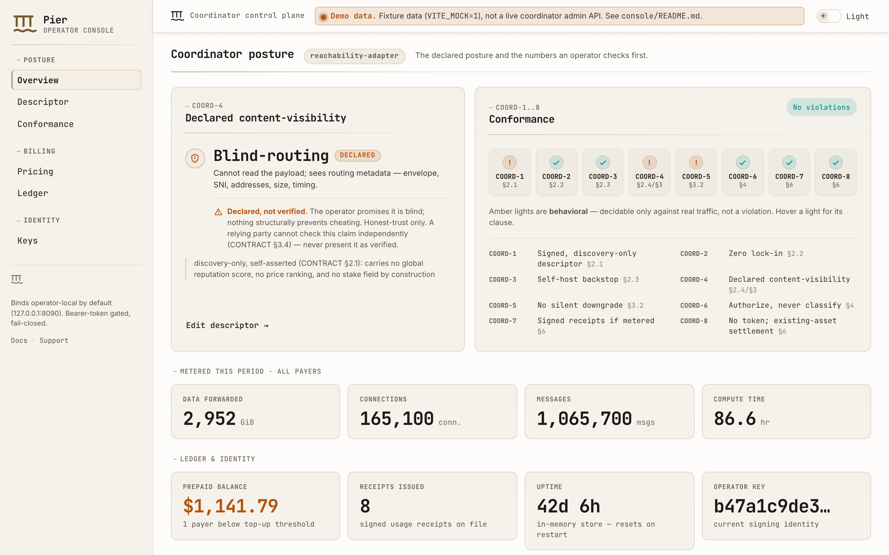
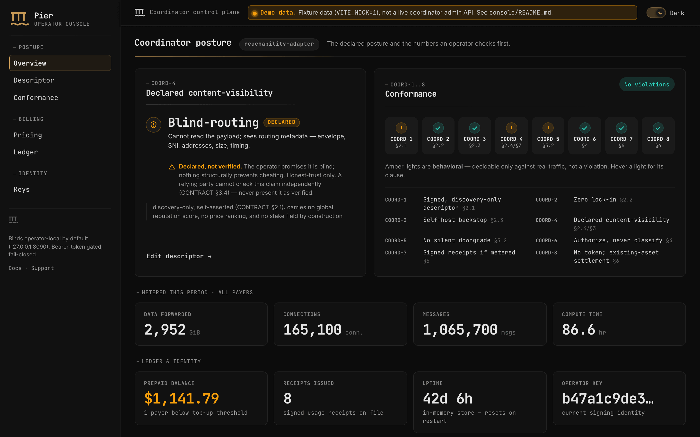
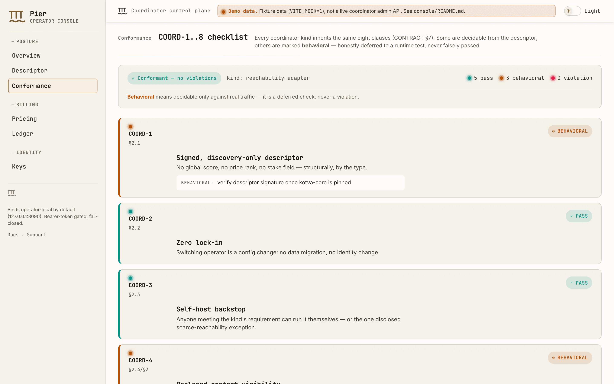
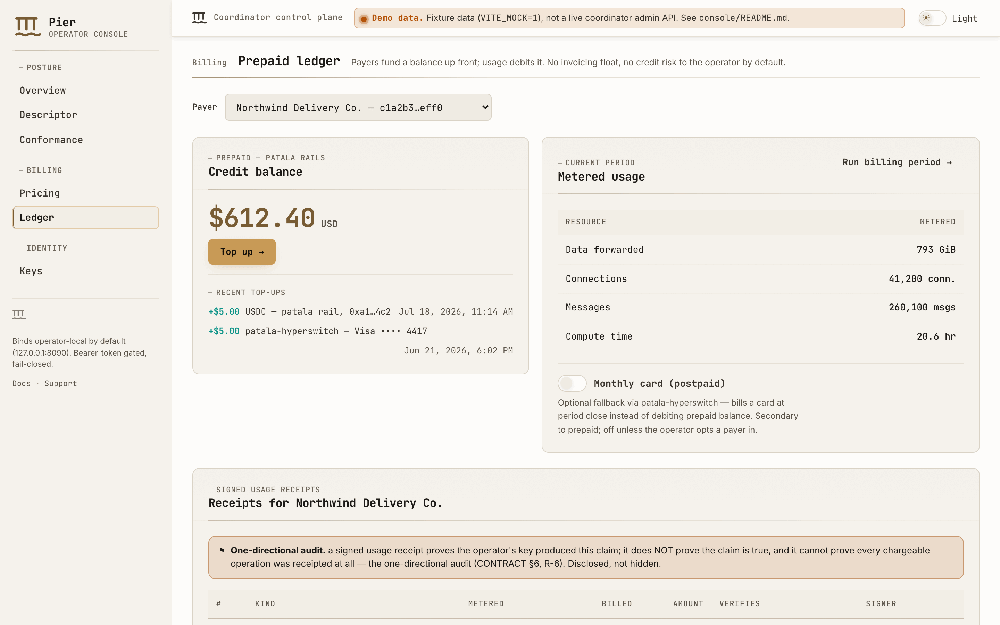
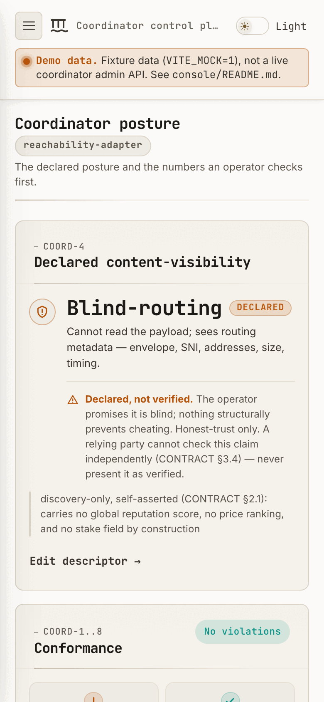

# Screenshots

Pier ships an **operator console** — a small web UI over the `pier-admin`
coordinator control plane. These are captures of it, regenerated from the real
build rather than drawn.

Every image below is reading **fixture data** (`VITE_MOCK=1`), not a live
coordinator. The console says so itself, in the strip along the top of each
capture; that is the console's own permanent disclosure, not a caption added
here.

## Overview

The posture page: the declared content-visibility class (COORD-4), the
COORD-1..8 conformance strip, and the figures an operator checks first.



The console follows the system theme and has its own toggle.



## Conformance

The COORD-1..8 checklist in full, one row per clause. Amber rows are
**behavioral** — decidable only against real traffic, and never reported as a
pass or as a violation.



## Prepaid ledger

Per-payer credit balance, current-period metered usage, and the signed usage
receipts on file.



## Narrow viewports

Below 900px the sidebar collapses to a drawer and the metric grid drops to one
column, so no figure is ellipsised.



## Regenerate

From the repo root:

```bash
pnpm --dir console build     # console/dist must exist first
npm run screenshots
```

Prerequisites: Node.js 20+, and `npm ci` in `scripts/` — Playwright downloads a
headless Chromium binary (~170 MB) on first install.

`scripts/screenshots.mjs` serves `console/dist` on a local static server, drives
it with headless Chromium, and writes every file above to `site/screenshots/`.

Captures are a **framed 1440 × 900 viewport** (390 × 844 for the narrow one) at
`deviceScaleFactor: 2`, so each PNG is twice those dimensions and is meant to be
presented at its CSS size. They are deliberately not full-page: a console
screenshot is meant to show the fold, and a full-page capture shows the fold
plus everything the layout was designed to push below it.

If ImageMagick is on `PATH` the captures are squeezed to a 256-colour palette
(roughly a 55% saving, no visible difference on flat UI); without it they are
written as plain PNGs and the script says so.

The script refuses to run against a console built for any brand other than the
default — these images are published, and no text-scanning gate can see inside
a PNG.
